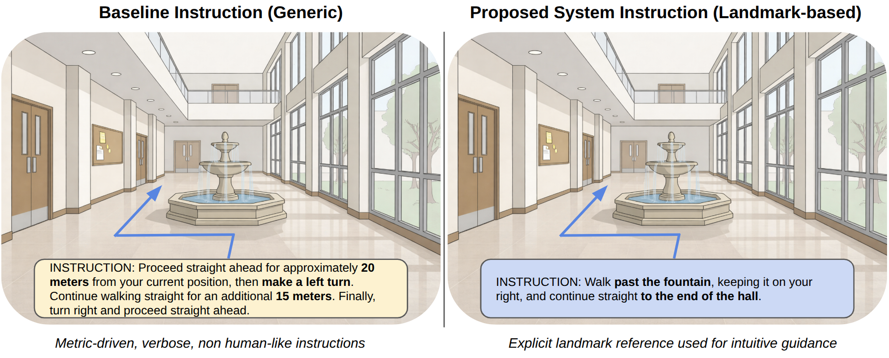
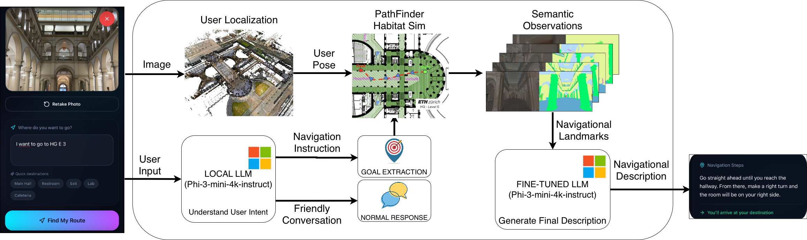
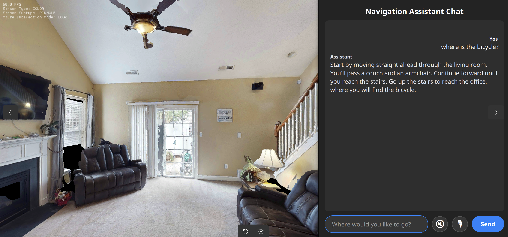
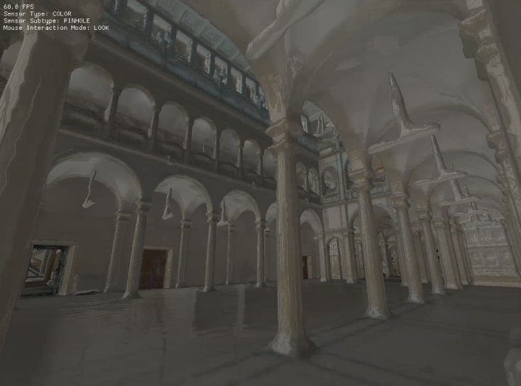
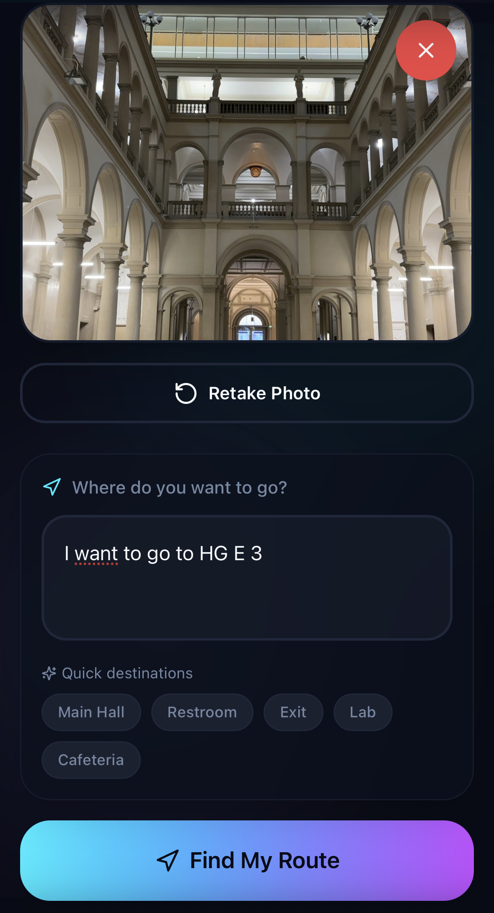
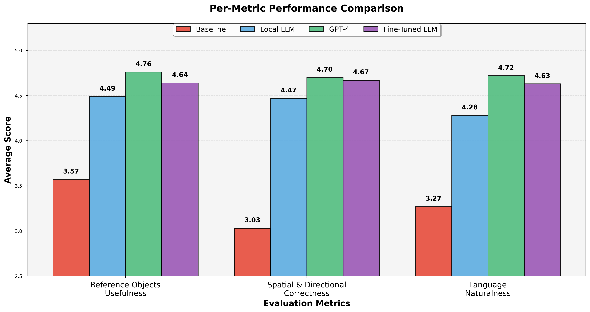
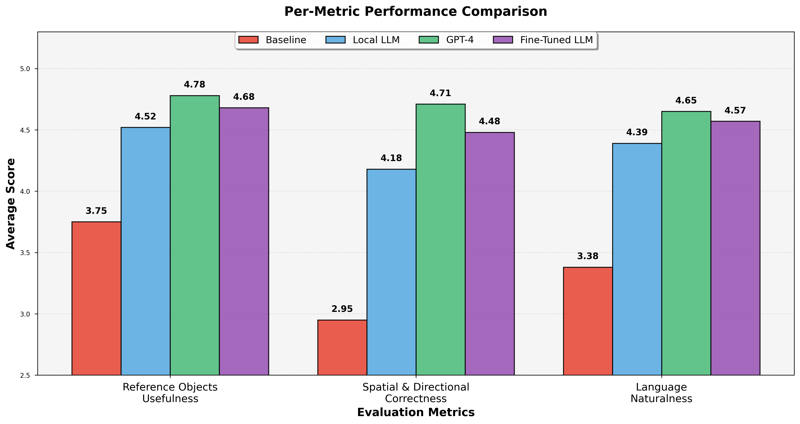

<div align="center">

<div align="center">
<table>
  <tr>
    <td align="center" valign="middle">
      
    </td>
    <td align="center" valign="middle">
      
    </td>
    <td align="center" valign="middle">
      
    </td>
  </tr>
</table>
</div>


# Landmark-Based Conversational Indoor Navigation

**A mixed-reality indoor navigation system generating human-like, landmark-grounded navigation instructions from a single RGB image and natural-language query**

[Installation](#-installation) •
[Demo](#-demo) •
[Pipeline](#-system-pipeline) •
[Evaluation](#-evaluation) •
[Contributors](#-contributors)

</div>

---

## 📖 Overview

Indoor navigation differs fundamentally from outdoor navigation: GPS is unreliable, maps are incomplete, and humans rely heavily on **local visual landmarks** rather than metric distances. This project, developed as part of the **Mixed Reality course (ETH Zurich / University of Zurich)**, presents a practical, deployable indoor navigation system that generates instructions the way people naturally do:

> _"Walk past the sofa, then turn right at the stairs."_

<div align="center">



*Comparison between baseline navigation instructions and our landmark-based, human-oriented guidance. The baseline approach (left) relies on metric and abstract descriptions, resulting in verbose and less intuitive instructions. In contrast, our method (right) explicitly references visible landmarks, producing concise and human-interpretable guidance.*

</div>

### Key Features

- 📷 **Single-image user localization** in reconstructed indoor environments
- 🧭 **Geometric path planning** with collision-free trajectories
- 🏷️ **Semantic landmark extraction** from perceptual observations
- 🗣️ **Concise, human-oriented navigation instructions**
- 🧠 **Lightweight on-device language model** (LoRA fine-tuned)
- 📱 **Web-based mobile interface** for real-world deployment
- 📊 **Quantitative evaluation + user study**

---

## 🎬 Demo

<div align="center">


https://github.com/user-attachments/assets/6b3f5116-117d-4b36-ab10-c9d678826362


*End-to-end demonstration of the landmark-based navigation system in action*

</div>

---

## 🏗️ System Pipeline

<div align="center">



*Overview of the proposed mixed-reality navigation system. Given a user image and a natural-language query through our web app, the system localizes the user, plans a path in Habitat-Sim, extracts semantic landmarks along the route, and generates grounded navigation instructions.*

</div>

### Pipeline Stages

1. **User Localization**: Estimate 6-DoF pose from a single RGB image using image-based localization against a pre-built 3D reconstruction
2. **Path Planning**: Compute collision-free trajectories using Habitat-Sim's planning module
3. **Landmark Extraction**: Densify the path, capture RGB/depth/semantic observations, and cluster visible objects into persistent semantic landmarks
4. **Instruction Generation**: Generate concise, fluent instructions grounded in visible landmarks using a fine-tuned lightweight language model

---

## 🔬 Experimental Setup

### HM3D House Environment

<div align="center">



*Experimental setup in the simulated house environment. The Habitat-Sim rendering is shown on the left, while the graphical interface for issuing navigation queries and visualizing instructions is shown on the right.*

</div>

This controlled environment allows us to:
- Evaluate instruction generation quality with known start and goal positions
- Compare different language models and landmark grounding strategies
- Isolate instruction quality from localization errors

### ETH HG Academic Building

<div align="center">



*ETH HG E floor environment with full semantic segmentation in Habitat-Sim*

</div>

This real-world building evaluation includes:
- Full pipeline evaluation with real image-based localization
- Web-based user interaction for practical deployment testing
- User studies with actual navigation queries

---

## 🔧 Installation

Detailed installation instructions are available in [SETUP.md](SETUP.md). We provide two installation options:

### Option 1: HM3D House Environment (Recommended)

Quick setup for exploring HM3D house environments with our finetuned model:

```bash
git clone https://github.com/rzninvo/CNSG.git
cd CNSG
bash scripts/install_hm3d.sh
```

**Run the system:**
```bash
conda activate habitat-default
cd habitat-sim
python examples/mr_viewer.py --backend=local --finetuned-model=True
```

### Option 2: ETH HG E Floor (Optional)

Full installation with semantic segmentation for the ETH HG academic building:

```bash
git clone https://github.com/rzninvo/CNSG.git
cd CNSG
bash scripts/install.sh
```

**Run the system:**
```bash
conda activate habitat-source
cd habitat-sim
python examples/mr_viewer.py --scene ./data/scene_datasets/HGE/HGE.basis.glb --dataset data/scene_datasets/HGE.scene_dataset_config.json
```

See [SETUP.md](SETUP.md) for complete installation instructions, environment setup, and troubleshooting.

---

## 📱 Web Application

The system includes a **mobile-friendly web interface** that enables real-world deployment and user interaction. Users can capture images of their surroundings and submit natural-language navigation queries through an intuitive interface.

<div align="center">



*Web interface for image submission and natural-language navigation queries*

</div>

### Running the Web App

The system can be run in two modes: **GUI mode** (default) or **server mode** (for web app integration).

#### Server Mode (Backend)

Start the navigation server to handle web app requests:

```bash
# For HM3D environment
conda activate habitat-default
cd habitat-sim
python examples/mr_viewer.py --server-mode --backend=local --finetuned-model=True
```

The server will start on `http://localhost:5000` and provide REST API endpoints for:
- Image-based localization
- Navigation instruction generation
- Path planning and visualization

#### Web Frontend

In a separate terminal, start the web application:

```bash
cd webapp
npm install
npm run dev
```

The web app will be available at `http://localhost:8080`.

#### Mobile Access with ngrok

To access the web app from a mobile device:

1. Install and authenticate ngrok:
   ```bash
   ngrok config add-authtoken <YOUR_NGROK_TOKEN>
   ```

2. Expose the frontend:
   ```bash
   ngrok http 8080
   ```

3. Expose the backend (in another terminal):
   ```bash
   ngrok http 5000
   ```

4. Update the frontend configuration to use the ngrok backend URL

5. Access the ngrok frontend URL from your mobile device

This setup enables real-world testing and user studies with actual mobile navigation queries.

---

## 📊 Evaluation

### Methodology

The system is evaluated across two complementary settings:

**Simulated House Environment (HM3D)**
- Controlled evaluation with known start and goal positions
- Isolates instruction generation quality
- Enables systematic comparison of language models

**Real Building Environment (HG Academic Building)**
- End-to-end pipeline evaluation
- Real image-based localization
- User studies with actual navigation queries

### Metrics

All instructions are evaluated on a 5-point Likert scale across three dimensions:

- **Reference Object Quality**: Accuracy and usefulness of landmark references
- **Spatial & Directional Correctness**: Accuracy of spatial relations and directions
- **Naturalness of Language**: Fluency and human-likeness of instructions

### Results

Our evaluation demonstrates that landmark-grounded instruction generation significantly outperforms baseline approaches across both evaluation environments.

<div align="center">



*Evaluation in the simulated house environment. Average scores for the three instruction quality metrics, comparing the different configurations. Higher scores indicate better performance.*

</div>

<div align="center">



*Evaluation in the HG building. Average scores for the three instruction quality metrics, comparing the different configurations. Higher scores indicate better performance.*

</div>

**Key Findings:**

- **Landmark grounding** provides substantial improvements over baseline approaches across all metrics
- **GPT-4** and our **fine-tuned local model** achieve comparable performance, with GPT-4 showing slight advantages in spatial correctness
- The **local baseline model** (without fine-tuning) already outperforms the non-landmark baseline, demonstrating the value of landmark-based reasoning
- Our **fine-tuned lightweight model** achieves near-GPT-4 performance while enabling fully on-device inference
- All landmark-grounded approaches show consistent improvements in **reference object quality** and **language naturalness**

### Latency Analysis

End-to-end latency profile:
- **Visual localization**: Primary bottleneck (~2-5s)
- **Path planning**: Minimal overhead (<0.5s)
- **Landmark extraction**: Real-time (~0.3s)
- **Instruction generation**: Negligible with local model (<1s)

The system maintains interactive latency suitable for real-world deployment while ensuring user privacy through local inference.

---

## 🧠 Lightweight Language Model

Our instruction generation leverages a **LoRA-finetuned Phi-3 model** that provides:

✅ **No cloud dependency** - Fully on-device inference
✅ **Low GPU memory footprint** - Suitable for resource-constrained devices
✅ **Privacy preservation** - No data leaves the device
✅ **Comparable quality** - Matches large proprietary models on navigation tasks

The fine-tuned model is specifically optimized for generating concise, landmark-grounded navigation instructions and achieves superior performance compared to general-purpose language models.

---

## 🚀 Future Work

### Current Limitations

- Single-image localization requires manual image capture
- Batch-style interaction rather than continuous guidance

### Planned Extensions

- 🎥 **Real-time egocentric video localization** for continuous tracking
- 🔄 **Continuous instruction refinement** based on user progress
- ⚡ **Latency optimization** for sub-second response times
- 🥽 **AR glasses deployment** for hands-free navigation

---

## 👥 Contributors

**Team Members**

- [Riccardo Bianco](https://github.com/RiccardoBianco) (ETH Zurich)
- [Francesco Bondi](https://github.com/FBondi) (ETH Zurich)
- [Roham Zendehdel Nobari](https://github.com/rzninvo) (ETH Zurich)
- [Shaurya Kishore Panwar](https://github.com/shauryakp) (University of Zurich)
- [Fatemeh Sadat Daneshmand](https://github.com/fatemeh-sd) (ZHAW Winterthur)

**Supervisors**

[Mahdi Rad](https://people.inf.ethz.ch/mrad/) · [Gabriele Goletto](https://gg22.me/) · [Kate Jaroslavceva](https://people.inf.ethz.ch/kjaroslavceva/)

**Affiliated Institutions**

<div align="center">

**Computer Vision and Geometry Group** | ETH Zurich
**Mixed Reality Lab** | University of Zurich
**Microsoft Mixed Reality & AI Lab** | Zurich

</div>

---

## 📄 License

MIT License © 2025 Landmark-Based Conversational Indoor Navigation Team

---

## 🙏 Acknowledgments

This project builds upon several excellent open-source projects:

- [Habitat-Sim](https://github.com/facebookresearch/habitat-sim) and [Habitat-Lab](https://github.com/facebookresearch/habitat-lab) for simulation infrastructure
- [Matterport3D](https://niessner.github.io/Matterport/) and [HM3D](https://aihabitat.org/datasets/hm3d/) for indoor scene datasets
- [Microsoft Phi-3](https://huggingface.co/microsoft/Phi-3-mini-4k-instruct) for the base language model
- [LaMAR](https://lamar.ethz.ch/) for localization benchmarking tools

---

<div align="center">

**[⬆ Back to Top](#landmark-based-conversational-indoor-navigation)**

</div>
